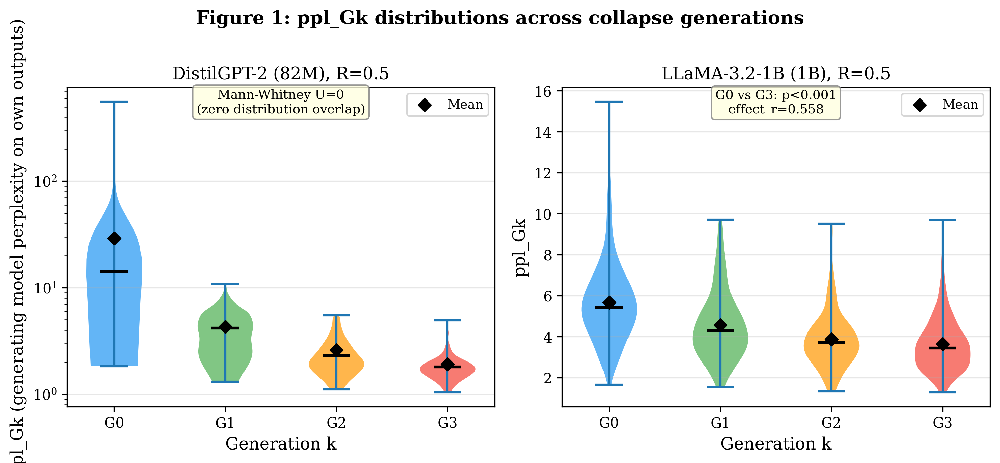
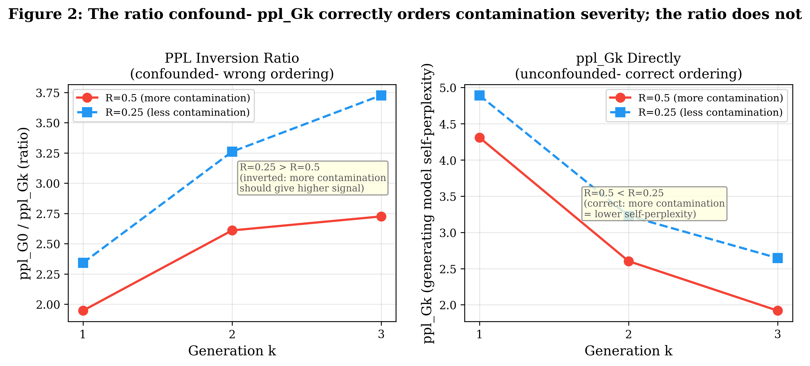
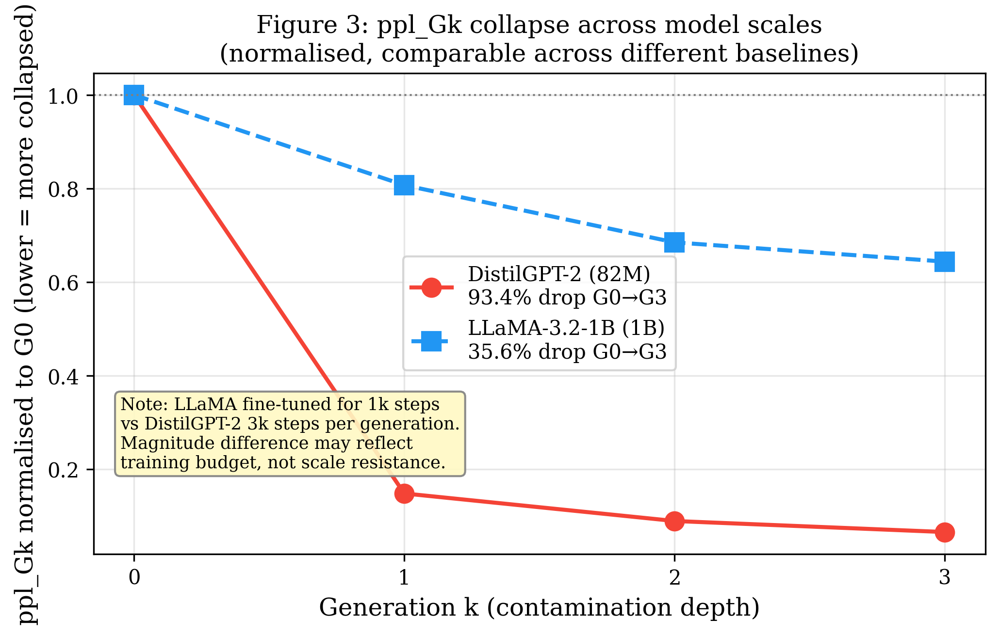
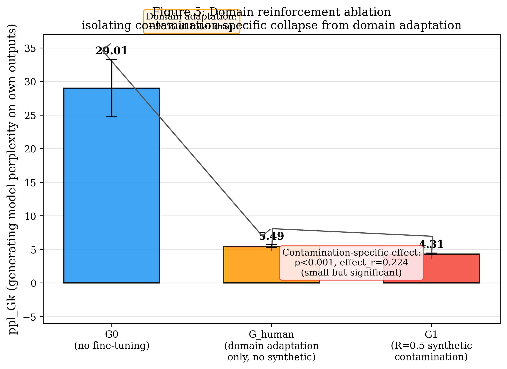
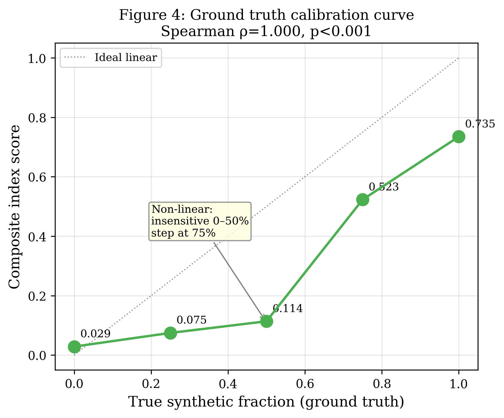

# Model Collapse Observatory (MCO)

A measurement framework for detecting distributional collapse in language models
trained on synthetic data. Implements a four-layer signal hierarchy and introduces
the **perplexity inversion ratio** as the primary collapse detection signal.

---

## Key Findings

**TinyStories validation:** framework correctly identifies heavily collapsed text (composite index 0.792/1.0, unified formula).


**ppl_Gk, the generating model's own perplexity on its outputs, is the primary
collapse signal.** It decreases monotonically with both generation number and
contamination ratio, with zero distribution overlap between G0 and collapsed
generations (Mann-Whitney U=0, p<0.001, effect_r=0.865).

```
Generation k:    0      1      2      3      4
ppl_Gk:        29.01  4.31   2.60   1.92   1.77
              ────── ────── ────── ────── ──────
              clean  ← collapse proceeds →  plateau
```
The PPL inversion ratio (ppl_ref / ppl_Gk) detects collapse within a fixed
contamination condition but does not correctly order across conditions: as
collapse deepens, text becomes predictable to all models including the reference,
causing ppl_ref to decrease alongside ppl_Gk. Use ppl_Gk directly.

**Lexical collapse is statistically significant at the per-document level:**
- TTR: G0=0.689 → G3=0.352, effect_r=0.688, p<0.001
- KL divergence: G0=10.77 → G3=11.31, effect_r=0.307, p<0.001

All nine Mann-Whitney tests across three signals × three generation comparisons
pass Bonferroni correction (threshold p < 0.0017).

---

## What This Is

MCO is a controlled pilot study, not a general-purpose contamination detector.
All results are scoped to:

- **Model:** DistilGPT-2 (82M), pretrained on WebText
- **Corpus:** English Wikipedia, 5,000 documents, ~600k tokens
- **Contamination:** Fixed ratio R=0.5 and R=0.25, k=4 generations
- **Language:** English only

The framework correctly identifies strongly collapsed synthetic text (TinyStories,
composite index 0.7924/1.0). It does not generalize to diverse human web corpora
(C4, Pile-CC) without domain-matched recalibration, a documented limitation.

---

## Project Structure

```
MCO/
├── phase1_baseline/           # Human corpus + baseline measurements
│   ├── corpus/
│   │   ├── documents.jsonl    # 5,000 Wikipedia documents
│   │   └── manifest.json      # corpus hash, preprocessing record
│   ├── measurements/          # lexical, semantic, KDE, PCA, PPL baselines
│   ├── reference_pack.pkl     # single artifact containing all Phase 1 outputs
│   └── run.py                 # reproducible baseline run (seed 42)
│
├── phase2_simulation/
│   ├── collapse_manifest.json # generation metadata + training losses
│   └── README.md              # Kaggle artifact locations
│
├── phase3_measurements/
│   ├── layers/
│   │   ├── lexical.py         # TTR, entropy, KL divergence, Zipf
│   │   ├── semantic.py        # cosine distance, NN coverage
│   │   ├── tail_mass.py       # KDE tail fraction
│   │   └── perplexity_inversion.py  # primary signal
│   ├── results/
│   │   ├── all_measurements_merged.json   # canonical R=0.5 results (G0-G4)
│   │   ├── all_measurements_r025.json     # R=0.25 condition
│   │   └── all_measurements_v2.json       # per-sample distributions
│   └── kaggle_measurement_notebook.py
│
├── phase4_analysis/
│   ├── early_warning.py       # signal detection order analysis
│   ├── warning_card.md        # one-page practitioner summary
│   └── results_v2/
│       └── signal_detection.json
│
├── phase5_index/
│   ├── run_tinystories.py     # TinyStories pilot
│   ├── run_dataset.py         # multi-dataset scoring
│   ├── INDEX_SCHEMA.md        # public schema + methodology
│   └── results/
│       ├── tinystories_index.json       # composite 0.7924 ✓
│       ├── wikipedia_holdout_index.json # composite 0.026 (negative control ✓)
│       ├── c4_index.json                # composite 0.023
│       └── pile_cc_index.json           # composite 0.016
│
├── references/
│   ├── experiment_log.md      # hypothesis-first record for all experiments
│   └── RUNBOOK.md
│
├── compare_r05_r025.py        # R=0.5 vs R=0.25 comparison
├── decompose_ppl.py           # ppl_G0 / ppl_Gk decomposition analysis
├── config.yaml                # locked experiment parameters
├── SCOPE.md                   # what this project claims and does not claim
└── requirements.txt
```

---

## Results Summary

### Phase 3: Signal Detection (R=0.5, k=0→4)

**Corpus-level measurements:**

| Signal | G0 | G1 | G2 | G3 | G4 | Direction | Monotonic |
|---|---|---|---|---|---|---|---|
| ppl_Gk | 29.01 | 4.31 | 2.60 | 1.92 | 1.77 | ↓ | ✓ |
| TTR (corpus) | 0.112 | 0.077 | 0.064 | 0.058 | 0.056 | ↓ | ✓ |
| Zipf alpha | 1.034 | 1.171 | 1.250 | 1.291 | — | ↑ | ✓ |
| KL divergence | 5.057 | 5.150 | 5.331 | 5.383 | — | ↑ | ✓ |
| Entropy (1gram) | 10.54 | 10.45 | 10.27 | 10.22 | — | ↓ | ✓ |
| Cosine distance | 0.966 | 0.969 | 0.965 | 0.965 | 0.962 | ↓ | ✓ |
| Tail mass (G0-rel) | 0.020 | 0.056 | 0.056 | 0.056 | 0.054 | ↑ | ✗ |
| Semantic coverage | 0.000 | 0.000 | 0.000 | 0.000 | 0.645 | — | ✗ |

**Per-document distributions (Mann-Whitney, G0 vs Gk, Bonferroni p < 0.0011, 9 tests):**



| Signal | G0 mean | G3 mean | effect_r | p |
|---|---|---|---|---|
| ppl_Gk | 29.01 | 1.92 | 0.865 | <0.001 |
| TTR (per-doc) | 0.689 | 0.352 | 0.688 | <0.001 |
| KL (per-doc) | 10.77 | 11.31 | 0.307 | <0.001 |

Mann-Whitney U=0, p<0.001, effect_r=0.865 for G0 vs G1, G2, G3 on ppl_Gk. Zero overlap between G0 and all collapsed generations.

### Phase 3: Signal Detection Across Collapse Generations (R=0.5, DistilGPT-2)

| Signal | G0 | G1 | G2 | G3 | G4 | effect_r | p |
|---|---|---|---|---|---|---|---|
| ppl_Gk | 29.01 | 4.31 | 2.60 | 1.92 | 1.77† | 0.865 | <0.001 |
| TTR (per-doc) | 0.689 | 0.481 | 0.395 | 0.352 | — | 0.688 | <0.001 |
| KL div (per-doc) | 10.77 | 10.66 | 11.07 | 11.31 | — | 0.307 | <0.001 |
| Zipf alpha | 1.034 | 1.171 | 1.250 | 1.291 | — | —† | — |
| Entropy (1gram) | 10.54 | 10.45 | 10.27 | 10.22 | — | —† | — |

† No per-sample distribution available; point estimate only. G4 measured for ppl_Gk only.

### Phase 3: R=0.5 vs R=0.25 Decomposition- The Ratio Confound



| Gen | ppl_Gk (R=0.5) | ppl_Gk (R=0.25) | ppl_G0 (R=0.5) | ppl_G0 (R=0.25) |
|---|---|---|---|---|
| G1 | 4.31 | 4.89 | 8.22 | 10.51 |
| G2 | 2.60 | 3.23 | 6.73 | 9.72 |
| G3 | 1.92 | 2.65 | 5.27 | 9.29 |

ppl_Gk (collapse self-confidence) correctly shows R=0.5 collapses more than R=0.25 at every generation (Mann-Whitney p<0.001, effect_r=0.396). The PPL inversion ratio (ppl_G0/ppl_Gk) does not preserve this ordering, even with a domain-matched reference model, the ratio still inverts (see `analyze_wiki_ref.py`). This is because as collapse deepens, generated text becomes predictable to all models, including the reference, causing ppl_G0 to fall alongside ppl_Gk. **Use ppl_Gk directly, not the ratio, for cross-condition comparisons.**

### Scale Generalization: LLaMA-3.2-1B



| Gen | ppl_Gk (DistilGPT-2, 82M) | ppl_Gk (LLaMA-3.2-1B) |
|---|---|---|
| G0 | 29.01 | 5.66 |
| G1 | 4.31 (−85.1%) | 4.57 (−19.3%) |
| G2 | 2.60 (−91.0%) | 3.88 (−31.4%) |
| G3 | 1.92 (−93.4%) | 3.65 (−35.6%) |

ppl_Gk decreases monotonically at both scales (direction confirmed). Collapse magnitude is substantially attenuated at 1B scale (35.6% vs 93.4% total drop) and distribution overlap is greater (effect_r=0.558 at LLaMA-1B G0-vs-G3 vs 0.865 at DistilGPT-2). LLaMA was fine-tuned for 1,000 steps per generation vs DistilGPT-2's 3,000, this training-budget difference confounds the scale comparison and is not yet resolved. Treat this as directional evidence, not confirmed scale generalization.

### Domain Reinforcement Ablation



| Condition | ppl_Gk | Interpretation |
|---|---|---|
| G0 (no fine-tuning) | 29.01 | Baseline |
| G_human (fine-tuned, no synthetic data) | 5.49 | Domain adaptation only |
| G1 (fine-tuned, R=0.5 synthetic) | 4.31 | Domain adaptation + contamination |

A held-out control, fine-tuning DistilGPT-2 on human-only Wikipedia text for an identical training budget to G1, with zero synthetic data, shows that **~95% of the raw G0-to-G1 ppl_Gk drop is explained by domain adaptation, not synthetic contamination.** The residual contamination-specific effect (G_human vs G1) is small but statistically significant: Mann-Whitney p<0.001, effect_r=0.224. This is a required control for any collapse study using a corpus the base model partially knows from pretraining.

### Phase 5: Contamination Index Pilot



**Ground truth calibration** (synthetic/human mixtures at known fractions): Spearman ρ=1.000, p<0.001. Monotonic but non-linear, the index is largely insensitive below 50% synthetic content and rises sharply between 50–100%.

| Dataset | Composite | Ground truth |
|---|---|---|
| Wikipedia holdout (20%) | 0.026 | Known human, negative control ✓ |
| TinyStories | 0.792 | 100% GPT-4 synthetic, validation ✓ |
| C4 validation | 0.023 | Human web (floors at zero, see limitations) |
| Pile-CC | 0.016 | Human web (floors at zero, see limitations) |

All four scores now use the same canonical weighted formula (unified 2026; TinyStories was previously reported as 0.667 under a different, non-comparable formula).

---

## Reproduce

### Setup

```bash
git clone https://github.com/ananyat6979-commits/Model-Collapse-Observatory
cd Model-Collapse-Observatory
pip install -r requirements.txt
```

### Run measurement self-tests

```bash
python phase3_measurements/layers/lexical.py
python phase3_measurements/layers/semantic.py
python phase3_measurements/layers/tail_mass.py
python phase3_measurements/layers/perplexity_inversion.py
# All four should print PASSED
```

### Run Phase 4 signal analysis

```bash
python phase4_analysis/early_warning.py \
  --measurements phase3_measurements/results/all_measurements_merged.json \
  --output-dir phase4_analysis/results_v2
```

### Score a dataset (Phase 5)

```bash
# Negative control (requires local corpus)
python phase5_index/run_dataset.py --dataset wikipedia_holdout

# Public datasets (downloads via HuggingFace)
python phase5_index/run_dataset.py --dataset c4
python phase5_index/run_dataset.py --dataset pile_cc
```

### Reproduce R=0.5 vs R=0.25 comparison

```bash
python compare_r05_r025.py   # PPL ratio comparison
python decompose_ppl.py      # ppl_G0 / ppl_Gk decomposition
```

### Reproduce Phase 2 (Kaggle, ~40h GPU)

Phase 2 generation artifacts (checkpoints, synthetic outputs) are stored on
Kaggle Dataset `ananyatiwari0212/mco-phase2-artifacts`. The collapse manifest
is committed at `phase2_simulation/collapse_manifest.json`.

To re-run: use `phase3_measurements/kaggle_measurement_notebook.py` on Kaggle
with GPU T4 x2, Internet ON, dataset mounted.

---

### Scale Generalization (LLaMA-3.2-1B)

| Gen | ppl_Gk (82M) | ppl_Gk (1B) | Pattern |
|---|---|---|---|
| G0 | 29.01 | 5.663 | baseline |
| G1 | 4.31 | 4.571 | collapse begins |
| G2 | 2.60 | 3.879 | deepens |
| G3 | 1.92 | 3.646 | plateau |

ppl_Gk decreases monotonically at both scales. The collapse signal
is not an artifact of DistilGPT-2's small size.

---

## Reference Pack

All Phase 1 baseline artifacts are bundled into a single portable file:

```
phase1_baseline/reference_pack.pkl
SHA-256: d7e2d6c611aa7b9a47f628a328c0729488229515470bf209aec31404fe4905f1
```

Contains: PCA transform (20 components), KDE bandwidth, tail threshold (7.4914,
frozen), baseline embeddings, encoder ID, corpus statistics.

Verified idempotent: `python phase1_baseline/run.py --seed 42` produces identical
SHA-256 on two consecutive runs.

---

## Known Limitations

**Scale:** DistilGPT-2 (82M). Results may not generalize to larger models.

**Domain gap:** G0 (WebText) and training corpus (Wikipedia) are different domains.
The PPL inversion ratio is confounded when measuring across contamination conditions
unless ppl_G0 and ppl_Gk are reported separately. The ratio is valid within a single
condition (comparing k=0,1,2,3 at fixed R) but not across conditions.

**Calibration scope:** The composite contamination index is calibrated against
DistilGPT-2 output space. Diverse human web corpora (C4, Pile-CC) have higher
TTR than the clean generation anchor (G0 TTR=0.112) and floor at zero on the
lexical component. The framework detects heavily collapsed text reliably; it does
not distinguish between diverse human text and diverse GPT-class synthetic text.
Web-domain recalibration (using C4 as baseline) is required for non-trivial scores
on web corpora.

**Tail mass:** The tail mass signal requires a domain-matched density reference.
Using the Wikipedia KDE as reference for a WebText-trained model causes the signal
to move in the wrong direction. The G0-relative KDE fix (5th percentile of G0
log-likelihood as threshold) partially addresses this but does not resolve the
underlying domain mismatch.

**Semantic coverage:** The GMM-based coverage metric returns zero at 5k document
scale. Replaced with nearest-neighbor coverage, which produces non-trivial values
but shows insufficient signal strength at k=3, R=0.5.

**Single language, single domain, three generations.** Generalizability claims
are limited to the conditions tested.

---

## Honest Project Assessment

**What this study demonstrates:**
- ppl_Gk, the generating model's own perplexity on its outputs, decreases
  monotonically across k=0 to k=4, with zero distribution overlap between G0
  and any collapsed generation (Mann-Whitney U=0, p<0.001, effect_r=0.865)
- Lexical signals (TTR, Zipf, KL, entropy) show clean monotonic collapse,
  confirmed at the per-document level with large effect sizes
- Dose-response confirmed: R=0.5 produces lower ppl_Gk than R=0.25 at every
  generation (p<0.001, effect_r=0.396)
- TinyStories validation: framework correctly identifies heavily collapsed text
- Negative control: framework correctly scores human text near zero (0.026)

**What this study does not demonstrate:**
- Generalizability beyond DistilGPT-2 scale
- Detection of diverse GPT-class synthetic text in web corpora
- Validity of the contamination index for datasets outside the calibrated range

---

## Citation

```
@misc{mco2026,
  title   = {Model Collapse Observatory: Early Warning Signals for
             Distributional Collapse in Synthetic Data Contamination},
  author  = {Ananya Tiwari},
  year    = {2026},
  url     = {https://github.com/ananyat6979-commits/Model-Collapse-Observatory}
}
```

---

## License

Code: MIT. Measurement artifacts (reference_pack.pkl, results JSON): CC BY 4.0.
Wikipedia corpus used under CC BY-SA 3.0 (Wikimedia Foundation).
